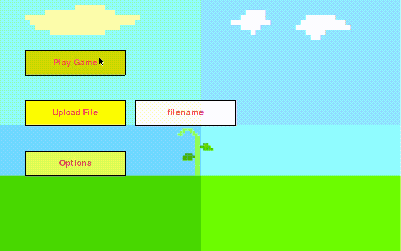

# sprouts-game
4th semester group project of the game 'Sprouts' in Python. 

# Core funtionality
 - Drawing lines using bezier curvers
 - Utilizing Rapidly-exploring Random Tree algorithm to suggest paths
 - Using point in polygon algorithm to detect game over state
 - Able to validate planarity of a game
